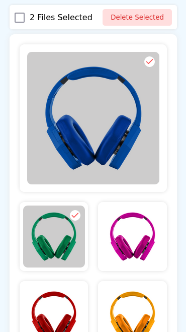

## Draggable and re-orderable image gallery

This is a simple image gallery that allows you to drag and re-order images. It is built using [React](https://reactjs.org/) and [dnd-kit](https://docs.dndkit.com/).

### Workflow

- The app is initiated with the app with [vitejs](https://vitejs.dev/)
- Used [dnd-kit](https://docs.dndkit.com/) to create the drag and drop functionality
- Avoided using ui library for this tiny project,

### Local Installation

- Clone the repo
- cd into the repo
- Run `pnpm i` to install dependencies
- Run `pnpm dev` to start the app

### Functionality

- Drag and drop images to re-order them
- Click on the image to select it
- Select All items by clicking on the checkbox on header
- Delete selected items by clicking on the delete button on header
- Delete single item by clicking on the delete button on the item

## Screenshots

 <b> Desktop Screenshots </b>

 <b> Mobile Screenshots </b> 

